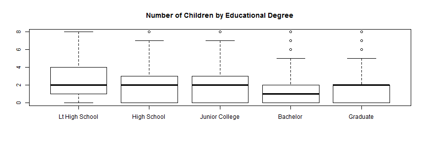
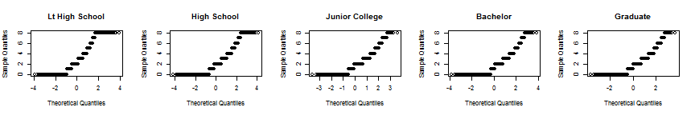

### Relationship between highest educational degree and number of children


### 1. Introduction:
This research aims to determine if there is any relationship between highest educational degree and number of children. The assumption to establish this research is that the higher degree, the less children which seems to be getting ubiquitous in many developed countries, but has not been confirmed in a concrete way. One of the reasons why we have a sense that more educated people have less children is the image how they work in a competitive market after they graduate though, work related matters are not mentioned in this research. The research focuses only on the relationship between highest educational degree and number of children.  


### 2. Data:
General Social Survey Cumulative File, 1972-2012 Coursera Extract  
Data source - http://bit.ly/dasi_gss_data  
Cookbook - https://d396qusza40orc.cloudfront.net/statistics%2Fproject%2Fgss1.html  

The data used for the research has originally been collected by ICPSR as General Social Survey (GSS) from 1972 to 2012 and modified for Data Analysis and Statistical Inference course in Coursera by Duke University(*1). 
GSS has been monitoring societal change and studying the growing complexity of American society. The cases are individual respondents to the survey and the population of interest is all noninstitutionalized, English and Spanish speaking persons 18 years of age or older, living in the United States.  
The variables this research focuses on are Highest educational degree (degree) and Number of children (child). Degree is a categorical variable which has five factors, Less Than High School, High School, Junior College, Bachelor, Graduate. Child is discrete numerical variable whose range is from 0 to 8.  
The research is observational and prospective study since the ICPSR merely observed the responses from people and did not assign subjects to specific treatments. This means that the conclusion can only establish the association, but not the causal connection, between the explanatory (degree) and the response (child) variables.  
The scope of inference is basically the same as the population though,  changes in method of sampling(*2) in early years can bias the result.  

(*1) The modification is only to remove missing values from the responses and to create factor variables when appropriate. This aims for convinience of studensts in the course and does not change the essential of survey result.   
(*2) 1972 through 1974 : a modified probability design, 1975 through 1976 : a transitional design(one-half is a modified probability design, the other is a full probability design), After 1977 : a full probability design   

### 3. Exploratory data analysis:
#### 3.1. Highest educational degree

```r
table(gss$degree)
```

```
## 
## Lt High School    High School Junior College       Bachelor       Graduate 
##          11822          29287           3070           8002           3870
```

```r
round(prop.table(table(gss$degree)), digits = 2)
```

```
## 
## Lt High School    High School Junior College       Bachelor       Graduate 
##           0.21           0.52           0.05           0.14           0.07
```

High school is dominant and occupies more than 50% of the sample population. Less than High School and Bachelor follow next. Those occupy 21% and 14% respectively. The remaining two, Graduate and Junior College are minorities which occupy less than 10% each.

#### 3.2. Number of children

```r
table(gss$child)
```

```
## 
##     0     1     2     3     4     5     6     7     8 
## 15493  9077 14058  8855  4654  2144  1097   614   888
```

```r
summary(gss$child)
```

```
##    Min. 1st Qu.  Median    Mean 3rd Qu.    Max.    NA's 
##    0.00    0.00    2.00    1.95    3.00    8.00     181
```

Overall, the count gets smaller as number of children increases. But a small spike on two children is observed. The mean and median also indicates that two children is the center of population.

#### 3.3. Intersection of two variables

```r
table(gss$child, gss$degree)
```

```
##    
##     Lt High School High School Junior College Bachelor Graduate
##   0           2181        7791            909     3136     1291
##   1           1691        4922            538     1161      637
##   2           2442        7559            837     1972     1049
##   3           1964        4670            465     1066      539
##   4           1357        2403            181      397      214
##   5            822         962             68      144       73
##   6            481         452             31       51       34
##   7            299         216             20       31       16
##   8            549         228             10       20       13
```

The overall tendency of number of children shown in 3.2. seems to be applicable to all degrees.

```r
boxplot(gss$child ~ gss$degree, main = "Number of Children by Educational Degree")
```

 

Median is 'two' children for all degrees except Bachelor. The box,  whisker and outliers above the median show that less number of respondents are dispersed to greater number (of children) as degree goes up. Considering this tendency, less number of children is expected as degree goes up.

### 4. Inference:
Based on the explanatory data analysis, a hypothesis test is performed. If the hypothesis test detects a significant difference in at least one pair, then it will proceed to pairwise comparisons to find out which pair have a significant difference.  

#### 4.1. Hypothesis
The following null and alternative hypothesis are used.  
H0 : The mean of number of children is the same across all degrees.  
HA : At least one pair of means are different from each other.  

#### 4.2. Check conditions for ANOVA
ANOVA is used for this hypothesis test. So the following three conditions are checked.  

(1) Independence  
 The sampling method applied to the GSS is mainly a full probability sampling. Therefore it can be said that it is random sampling. Also the proportion of each degree is obviously less than 10% of the population. Thus independence is satisfied.  

(2) Approximate normality  
 The following Q-Q plots show that distribution in each degree is slightly deviates from normal though, it can be covered by the big sample size.  


 

(3) Equal variance  

```r
lapply(split(gss$child, gss$degree), sd, na.rm = TRUE)
```

```
## $`Lt High School`
## [1] 2.16
## 
## $`High School`
## [1] 1.648
## 
## $`Junior College`
## [1] 1.51
## 
## $Bachelor
## [1] 1.47
## 
## $Graduate
## [1] 1.481
```

Standard deviations for each degree are approximately the same although Lt High School has a slightly higher SD. So it can be said that variance in each degree is approximately the same.  

As a total, the dataset satisfies the conditions required for ANOVA.

#### 4.3. Perform ANOVA

```r
anova(lm(gss$child ~ gss$degree))
```

```
## Analysis of Variance Table
## 
## Response: gss$child
##               Df Sum Sq Mean Sq F value Pr(>F)    
## gss$degree     4   9323    2331     780 <2e-16 ***
## Residuals  55887 167023       3                   
## ---
## Signif. codes:  0 '***' 0.001 '**' 0.01 '*' 0.05 '.' 0.1 ' ' 1
```

The outcome of ANOVA shows a very small p-value < 2.2e-16 which is found under the curve of the F-distribution above the F-value 780. This result provides a convincing evidence that at least one pair of population means is different from each other.  

#### 4.4. Perform Tukey's test
To find out which two degrees have a significant difference, Tukey's test is performed. Tukey's test compares all possible combinations of means and see whether there is a significant difference in each comparison without inflating Type 1 error rate.

```r
TukeyHSD(aov(gss$child ~ gss$degree), conf.level = 0.95)
```

```
##   Tukey multiple comparisons of means
##     95% family-wise confidence level
## 
## Fit: aov(formula = gss$child ~ gss$degree)
## 
## $`gss$degree`
##                                  diff      lwr     upr  p adj
## High School-Lt High School    -0.7952 -0.84667 -0.7437 0.0000
## Junior College-Lt High School -1.0024 -1.09814 -0.9068 0.0000
## Bachelor-Lt High School       -1.2465 -1.31487 -1.1781 0.0000
## Graduate-Lt High School       -1.1120 -1.19936 -1.0246 0.0000
## Junior College-High School    -0.2072 -0.29685 -0.1176 0.0000
## Bachelor-High School          -0.4513 -0.51086 -0.3917 0.0000
## Graduate-High School          -0.3168 -0.39746 -0.2360 0.0000
## Bachelor-Junior College       -0.2440 -0.34433 -0.1438 0.0000
## Graduate-Junior College       -0.1095 -0.22362  0.0046 0.0671
## Graduate-Bachelor              0.1345  0.04213  0.2269 0.0007
```

The result shows that:  
1. The mean of Lt High School is significantly bigger than the others.  
2. The mean of High School is significantly bigger than three higher degrees.  
3. The mean of Junior College is significantly bigger than Bachelor, but there is no significant difference against Graduate since the P-value 0.0671 is greater than 0.05.  
4. The mean of Bachelor is significantly bigger than Graduate.  

### 5. Conclusion:
Based on the result of the Tukey's test, the assumption of this study which is the higher degree, the less children is correct for the three lower degrees (Lt High School, High School, Junior College), but the situation of the higher three degree (Junior College, Bachelor, Graduate) is a little different. There is no significant difference between Junior College and Graduate and the relationship between Bachelor and Graduate is the opposite from the assumption.  
According to the p-value of the comparison of Bachelor and Graduate (0.00068), the difference (0.1345) is significant though, the diffrence itself is small and the lower boundary of confidence interval (0.04212) is very close to zero. This indicates that there is almost no difference between two possibly. This can lead a conclusion that there is no significant difference among the higher three degrees.  
To sum up those pieces, it is generally concluded that the higher degree, the less children in the three lower degrees, but in the higher three degree almost the same number of children is expected. In other words, number of children goes up as educational degree goes up until Junior College.

In this study, change through time is not considered. If the dataset is divided into several time groups and the same series of tests are performed to each time group, different conclusions might be led to each. My guess is that more recent, the more significant difference appears. But this is left for the future research.
